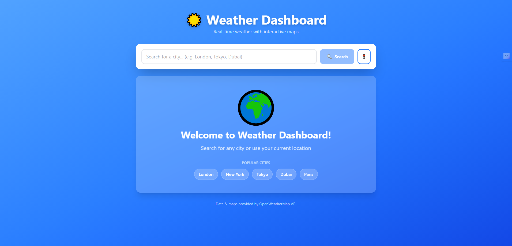
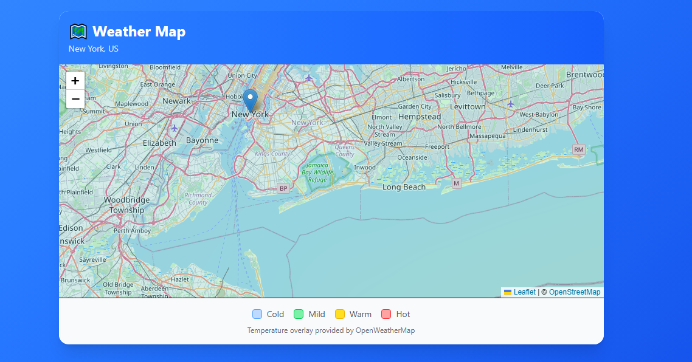

# 🌤️ Weather Dashboard

A modern weather app with a lot of features that gives you real-time weather data, 5-day forecasts, and interactive weather maps for cities all over the world.


## ✨ Features

- 🔍 **City Search** - Search weather for any city worldwide
- 📍 **Geolocation** - Automatic weather detection for current location
- 🌡️ **Unit Toggle** - Switch between Celsius and Fahrenheit
- 📅 **5-Day Forecast** - Detailed weather predictions
- 🗺️ **Interactive Maps** - Weather overlay maps with multiple layers
  - Temperature overlay
  - Cloud coverage
  - Precipitation
  - Wind speed
- 🕒 **Search History** - Quick access to recently searched cities
- 💾 **Persistent Storage** - Saves preferences and history locally
- 📱 **Responsive Design** - Works seamlessly on all devices
- ⚡ **Fast Performance** - Built with Vite for optimal speed

## 🎯 Live Demo

**[View Live Application](https://weather-app-bice-omega-21.vercel.app/)**

## 📸 Screenshots

### Desktop View



### Interactive Map


## 🛠️ Built With

- **[React 18](https://react.dev/)** - Frontend framework
- **[TypeScript](https://www.typescriptlang.org/)** - Type safety
- **[Zustand](https://github.com/pmndrs/zustand)** - Lightweight state management
- **[Tailwind CSS](https://tailwindcss.com/)** - Utility-first styling
- **[Leaflet](https://leafletjs.com/)** - Interactive maps
- **[React Leaflet](https://react-leaflet.js.org/)** - React components for Leaflet
- **[Axios](https://axios-http.com/)** - HTTP client
- **[OpenWeatherMap API](https://openweathermap.org/api)** - Weather data provider
- **[Vite](https://vitejs.dev/)** - Build tool and dev server

## 🚀 Getting Started

### Prerequisites

- Node.js 16+ and npm
- OpenWeatherMap API key ([Get it free here](https://openweathermap.org/api))

### Installation

1. **Clone the repository**
```bash
   git clone https://github.com/aliraza732-hub/weather-app.git
   cd weather-app
```

2. **Install dependencies**
```bash
   npm install
```

3. **Create environment file**
   
   Create `.env` in the root directory:
```env
   VITE_WEATHER_API_KEY=your_api_key_here
```

4. **Start development server**
```bash
   npm run dev
```

5. **Open your browser**
   
   Navigate to [http://localhost:5173](http://localhost:5173)

### Build for Production
```bash
npm run build
```

The build output will be in the `dist/` folder.

## 📁 Project Structure
```
weather-app/
├── src/
│   ├── components/          # React components
│   │   ├── SearchBar.tsx
│   │   ├── SearchHistory.tsx
│   │   ├── CurrentWeather.tsx
│   │   ├── ForecastList.tsx
│   │   ├── ForecastCard.tsx
│   │   ├── WeatherMap.tsx
│   │   └── MapControls.tsx
│   ├── services/            # API services
│   │   └── weatherApi.ts
│   ├── store/              # State management
│   │   └── useWeatherStore.ts
│   ├── types/              # TypeScript types
│   │   └── weather.ts
│   ├── utils/              # Utility functions
│   │   └── leafletFix.ts
│   ├── App.tsx             # Main app component
│   ├── main.tsx            # Entry point
│   └── index.css           # Global styles
├── public/                 # Static assets
├── .env                    # Environment variables (not in repo)
├── .env.example            # Example env file
├── package.json
├── tsconfig.json
├── tailwind.config.js
└── vite.config.ts
```

## 🔑 API Key Setup

1. Sign up at [OpenWeatherMap](https://openweathermap.org/)
2. Navigate to **API Keys** section in your account
3. Generate a new API key (free tier includes 1,000 calls/day)
4. Wait 10-15 minutes for activation
5. Add to your `.env` file

## 💡 Key Features Explained

### State Management with Zustand
Implemented lightweight, efficient state management using Zustand. The store handles:
- Current weather data
- 5-day forecast
- Search history (persisted to localStorage)
- Unit preferences (Celsius/Fahrenheit)
- Loading and error states

### API Integration
Integrated multiple OpenWeatherMap API endpoints:
- **Current Weather API** - Real-time weather data
- **5-Day Forecast API** - Weather predictions
- **Weather Maps API** - Tile layers for interactive maps

### Data Transformation
Raw API data is processed and formatted for optimal UI display:
```typescript
// Example: Unix timestamp → readable date
const date = new Date(item.dt * 1000);
const dayName = date.toLocaleDateString('en-US', { weekday: 'short' });
```

### Responsive Design
Mobile-first approach using Tailwind CSS:
- Flexible grid layouts
- Responsive typography
- Touch-friendly interactive elements

## 🧠 What I Learned

- **API Integration:** Working with RESTful APIs, handling async operations with async/await
- **State Management:** Managing complex application state with Zustand and localStorage
- **TypeScript:** Strong typing for API responses and component props
- **Maps Integration:** Implementing interactive maps with Leaflet and custom overlays
- **Error Handling:** Graceful error handling and user feedback
- **Performance:** Optimizing re-renders and API calls
- **Deployment:** Environment variables and production builds

## 🐛 Known Issues

- Map tiles may load slowly on slower connections
- API rate limiting on free tier (1000 calls/day)

## 🔮 Future Enhancements

- [ ] Hourly forecast (24-hour view)
- [ ] Weather alerts and warnings
- [ ] Multiple city comparison
- [ ] Dark mode support
- [ ] Historical weather data charts
- [ ] Air quality index
- [ ] UV index display
- [ ] Sunrise/sunset times
- [ ] PWA support for offline access

## 📝 License

This project is licensed under the MIT License - see the [LICENSE](LICENSE) file for details.

## 👨‍💻 Author

**Your Name**

- GitHub: [@yourusername](https://github.com/aliraza732-hub)
- LinkedIn: [Your Profile](https://linkedin.com/in/ali32)
- Email: alirazamehar732@gmail.com

## 🙏 Acknowledgments

- Weather data provided by [OpenWeatherMap](https://openweathermap.org/)
- Map tiles from [OpenStreetMap](https://www.openstreetmap.org/)
- Icons and design inspiration from modern weather applications

---

⭐ If you found this project helpful, please give it a star!